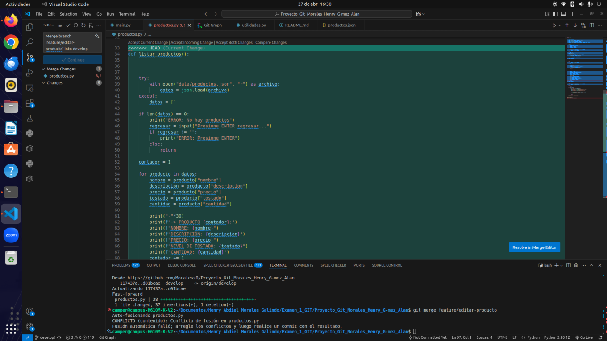
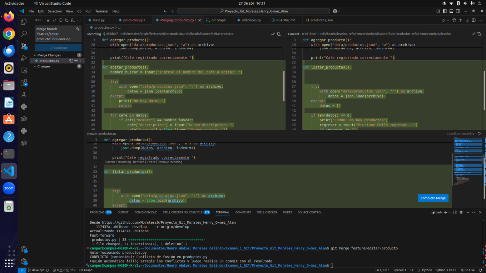

# ☕ Cafetería AromaCampus

> Sistema de gestión de productos para una cafetería artesanal, desarrollado en Python y controlado con Git y GitHub.

---

## 📖 Descripción

**Cafetería AromaCampus** es un emprendimiento enfocado en la venta de café artesanal y personalizado.
Este proyecto consiste en el desarrollo de un sistema que permite registrar y gestionar los distintos tipos de café disponibles en la tienda.

El sistema permite:

* Registrar nuevos productos
* Editar información existente
* Eliminar productos
* Lista los productos
* Guardar la información en un archivo JSON

Además, se implementa control de versiones con Git para garantizar la trazabilidad del desarrollo.

---

## ⚙️ Tecnologías utilizadas

* Python
* JSON
* Git
* GitHub

---

## 🧰 Requisitos previos

* Tener instalado Python 3.x
* Tener Git instalado

---

## 📂 Estructura del proyecto

```
📁 Proyecto
│
├── main.py              # Archivo principal de ejecución
├── productos.py         # Funciones relacionadas a productos
├── utilidades.py        # Funciones auxiliares
├── data/
│   └── productos.json   # Base de datos en formato JSON
└── README.md            # Documentación del proyecto
```

---

## 🚀 Funcionalidades

### 📌 Gestión de productos

Cada producto (café) contiene:

* Nombre
* Descripción
* Precio
* Nivel de tostado (ligero, medio, oscuro)
* Disponibilidad (en stock / sin stock)

El sistema permite:

* ➕ Agregar productos
* ✏️ Editar productos
* ❌ Eliminar productos
* 📋 Listar productos

---

## 💾 Almacenamiento

Los datos se almacenan en:

```
data/productos.json
```

---

## 🖥️ Uso del sistema

Al ejecutar el programa:

```
python main.py
```

Se mostrará un menú en consola donde el usuario podrá:

1. Agregar productos
2. Editar productos
3. Eliminar productos
4. Listar productos

---

## 🔀 Control de versiones

### 🌿 Ramas utilizadas

* `main`
* `develop`
* `feature/agregar-producto`
* `feature/editar-producto`
* `feature/eliminar-producto`
* `feature/listar-productos`
* `feature/menu`
* `feature/menu-actualizacion`
* `feature/actualizar-readme`

---

## 🔄 Flujo de trabajo

1. Se creó una rama por cada funcionalidad
2. Se desarrolló cada módulo de forma independiente
3. Se realizaron commits frecuentes y descriptivos
4. Se integraron cambios en la rama `develop`
5. Se resolvieron conflictos cuando fue necesario
6. Se realizó merge final hacia `main`

---

## 📈 Trazabilidad del desarrollo

Historial real de commits del proyecto:

```
266dfe2 feat: Se actualizo el menu
59ea6ce feat: Se agrega la funcion eliminar producto
75b781c feat: Se unen las ramas
d01bcae feat: Se agrega la funcion listar productos
117437a feat: Se une la rama feature a develop
488d0a7 feat: Se agrega la funcion editar producto
afbc846 feat: Se agrega la funcion menu
fc965dc feat: Se agrega la funcion agregar producto
177a876 feat: Se agregan los archivos principales
```

Esto demuestra:

* Desarrollo progresivo del sistema
* Separación por funcionalidades
* Integración controlada mediante merges

---

## 🔁 Pull Requests

* Cada funcionalidad fue integrada mediante Pull Requests
* Se realizaron revisiones antes del merge
* Se documentaron los cambios realizados

---

## ⚠️ Resolución de conflictos

Se simuló un conflicto entre ramas al agregar codigo en las mismas lineas del mismo archivo.

### 🧪 Conflicto generado

```python


```

---

### 🛠️ Solución

Se decidió conservar ambas funcionalidades:

Luego:

```
git add .
git commit -m "feat: 🔀 Se unen las ramas"
```

---

## 📋 Gestión del proyecto

### 🧩 Issues creados

1. Agregar productos
2. Editar productos
3. Eliminar productos
4. Listar productos

---

## 🏷️ Versiones

Versión estable del proyecto:

```
v1.0.0
```

---

## ▶️ Ejecución

```
git clone <URL_DEL_REPOSITORIO>
cd Proyecto
python main.py
```

---

## 📌 Notas finales

* Sistema basado en consola
* Uso de JSON como almacenamiento local
* Aplicación práctica de Git y GitHub en un entorno real

---

## 👤 Autor

Henry Morales
Alan Gomez
